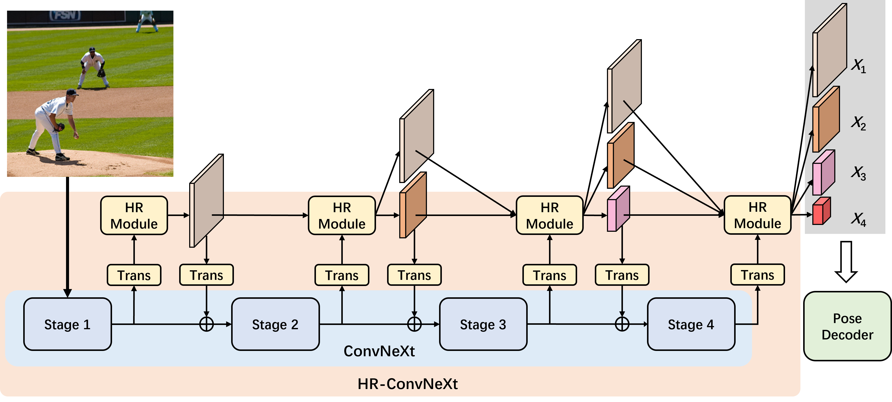

# ConvNeXtPose
Official code repository for the paper: 
[**ConvNeXtPose: Adapting ConvNeXt with High-Resolution Representation for Multi-Person Human Pose Estimation**]

<p align="left"></p>

## Main Results
### Results on COCO val2017
| Backbone          | Flipping Test | Multi-Scale Test | AP   | AP .5 | AP .75 | AP (M) | AP (L) |
|-------------------|---------------|------------------|------|-------|--------|--------|--------|
| **ConvNeXt-Base** | &#10008;      | &#10008;         | 75.6 | 91.1  | 81.8   | 71.0   | 82.1   |
| **ConvNeXt-Large**| &#10008;      | &#10008;         | 76.0 | 91.3  | 82.8   | 71.5   | 82.6   |
| **ConvNeXt-Large**| &#10004;      | &#10004;         | 76.9 | 91.7  | 83.3   | 72.6   | 83.5   |

### Results on COCO test-dev2017                                                                     
| Backbone          | Flipping Test | Multi-Scale Test | AP   | AP .5 | AP .75 | AP (M) | AP (L) |
|-------------------|---------------|------------------|------|-------|--------|--------|--------|
| **ConvNeXt-Base** | &#10008;      | &#10008;         | 74.2 | 91.7  | 81.5   | 70.0   | 80.2   |
| **ConvNeXt-Large**| &#10008;      | &#10008;         | 74.6 | 91.7  | 81.9   | 70.5   | 80.3   |
| **ConvNeXt-Large**| &#10004;      | &#10004;         | 75.2 | 92.2  | 82.4   | 71.3   | 81.2   |

### Results on CrowdPose test
| Backbone          | Flipping Test | Multi-Scale Test |  AP  | AP .5 | AP .75 | AP (E) | AP (M) | AP (H) |
|-------------------|---------------|------------------|------|-------|--------|--------|--------|--------|
| **ConvNeXt-Base** | &#10008;      |&#10008;          | 72.9 | 90.7  | 78.4   | 79.7   | 73.8   | 65.2   |
| **ConvNeXt-Large**| &#10008;      |&#10008;          | 73.7 | 91.5  | 79.5   | 80.3   | 74.6   | 65.3   |
| **ConvNeXt-Large**| &#10004;      |&#10004;          | 74.6 | 91.7  | 80.6   | 81.4   | 75.6   | 65.5   |
  

## Model Zoo
Please download models from [Google Drive](https://drive.google.com/drive/folders/12I2HtWBXHGwj_HmI-8eTD5ExzKvvxi_w?usp=drive_link).

## Data Preparation
**For COCO data**, please download from [COCO](http://cocodataset.org/#download). 
**For CrowdPose data**, please download from [CrowdPose](https://github.com/Jeff-sjtu/CrowdPose#dataset).
Extract them under ${YOUR_DATA_DIR}, and make them look like this:
```
${YOUR_DATA_DIR}
    |-- coco
    `-- |-- annotations
        |   |-- person_keypoints_train2017.json
        |   |-- person_keypoints_val2017.json
        |   `-- image_info_test-dev2017.json
        |-- train2017
        |-- val2017
        `-- test2017
            
    |-- crowdpose
    `-- |-- json
        |   |-- crowdpose_trainval.json
        |   `-- crowdpose_test.json
        `-- images
```

## Quick Start
1. Clone this repo.

2. Install dependencies:
   ```
   pip install -r requirements.txt
   ```

3. Download the pretrained backbones from [ConvNeXt-V2](https://github.com/facebookresearch/ConvNeXt-V2) and **Openmmlab**[[w32](https://download.openmmlab.com/mmpose/pretrain_models/hrnet_w32-36af842e.pth), [W48](https://download.openmmlab.com/mmpose/pretrain_models/hrnet_w48-8ef0771d.pth)], then place them in the 'pretrained' directory.
            

4. Training with multiple gpus:
    ```
    python test.py \
        config/coco/hrcomer_convnextB_768.py --num_gpus ${NUM_GPUS} --distributed True
    ```

5. Testing with single gpu:

    ```
    python test.py \
        config/coco/hrcomer_convnextB_768.py ${MODEL PATH}
    ```    

6. Testing with multiple gpus:

    ```
    python test.py \
        config/coco/hrcomer_convnextB_768.py ${MODEL PATH} --num_gpus ${NUM_GPUS} --distributed True
    ```

⚠️ Please modify the data path in the config file before training or testing. To execute **Multi-Scale Test**, the 'test_scale_factors = [1]' should be set to 'test_scale_factors = [1, 0.75, 1.25]'.

## Acknowledgement

Thanks to:

- [MMPose](https://github.com/open-mmlab/mmpose)
- [ConvNeXt-V2](https://github.com/facebookresearch/ConvNeXt-V2)

## License

This project is released under the [Apache 2.0 license](LICENSE).
